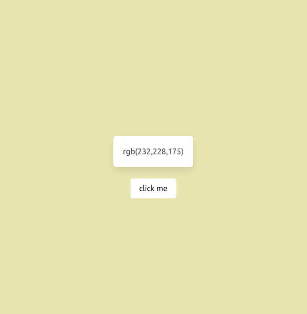

### what i learned from this

1. how to generate a random number between two limits

```js
let random_number = Math.floor(Math.random() * (max - min + 1) ) + min;
```
#### how it does it

example:
```
    suppose min = 50
            max = 100
       then 
       random_number = Math.floor(0.6745499913954294 * (100 - 50 +1)) + 50 = 84
                       Math.floor(0.8457439278397998 * (100 - 50 +1)) + 50 = 93
                       Math.floor(0.7848428885036685 * (100 - 50 +1)) + 50 = 90

       the Math.random() function returns  a random number between 0 (inclusive),  and 1 (exclusive)  => [0,1)
```

2. About RGB colors

RGB color --> rgb(red, green, blue).

Each parameter (red, green, and blue) defines the intensity of the color as an integer between 0 and 255.

3. How to add a eventlistener to an element

Here eventlistener is binded with the button
```html
 <button onclick="changeColors()"  class="button is-white">click me</button>
 ```
